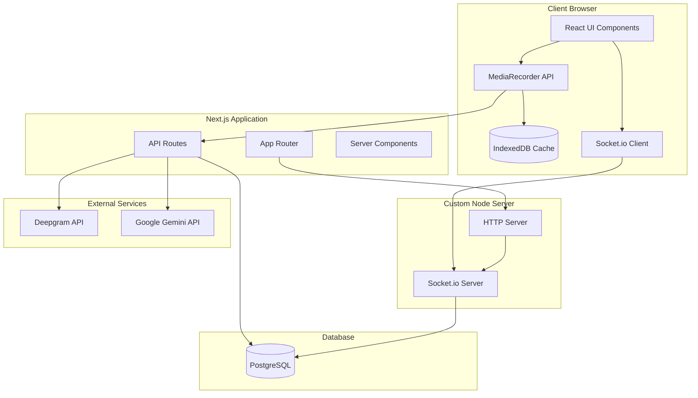
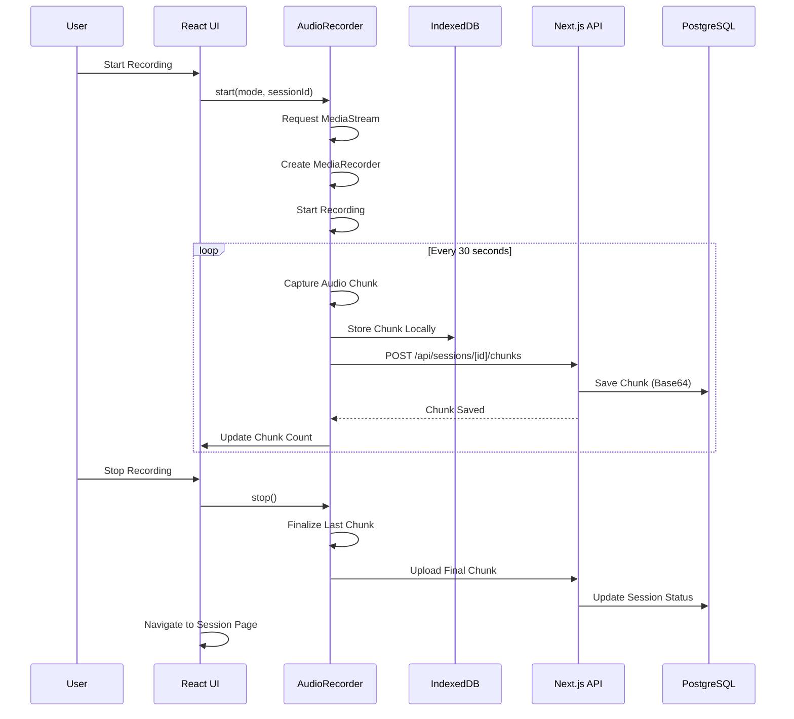
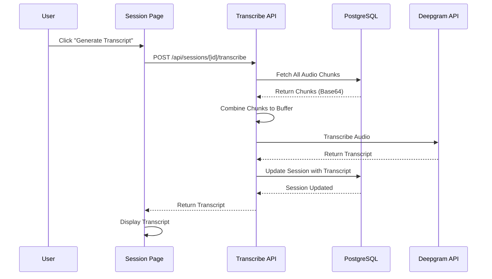
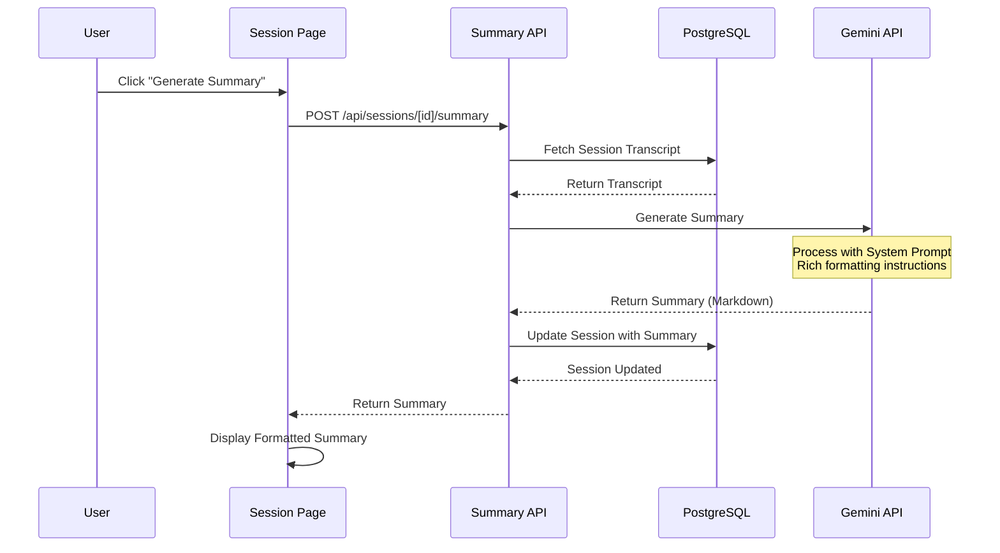
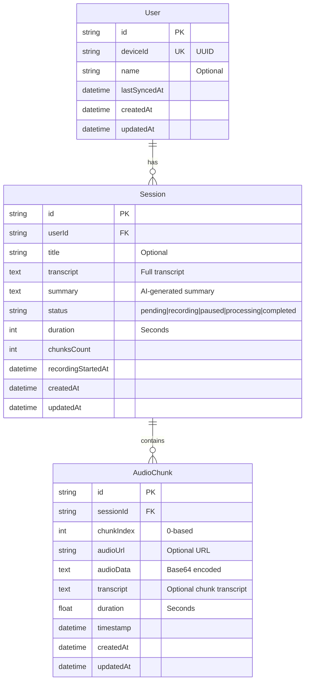

# Architecture & System Design

## Overview

ScribeAI is built as a full-stack Next.js application with a custom Node.js server for Socket.io integration. The architecture is designed to handle long-duration audio recordings (1+ hours) with efficient chunking, real-time updates, and on-demand transcription.

## System Architecture



## Data Flow

### Recording Flow



### Transcription Flow



### Summary Generation Flow



## Database Schema



## Component Architecture

### Frontend Components

```
app/
├── page.tsx                    # Main recording interface
├── sessions/[id]/page.tsx      # Session details page
└── layout.tsx                   # Root layout with Toaster

components/
├── RecordingInterface.tsx       # Recording controls & visualizer
├── RecordingPopup.tsx          # Mode selection dialog
├── SessionSidebar.tsx          # Session history sidebar
├── Timer.tsx                   # Recording timer display
├── PitchVisualizer.tsx         # Audio waveform visualization
└── ui/                         # Reusable UI components

hooks/
├── useAudioRecorder.ts         # Audio recording logic
├── useAudioAnalyzer.ts         # Audio analysis for visualization
├── useDevice.ts                # Device ID management
├── useSessions.ts              # Session data management
├── useChunkPlayback.ts         # Audio playback functionality
└── useSocket.ts                # Socket.io connection
```

### Backend Architecture

```
server.ts                       # Custom HTTP server with Socket.io
server/
├── socket.ts                   # Socket.io event handlers
└── transcription-handler.ts    # Transcription persistence logic

app/api/
├── sessions/
│   ├── route.ts                # GET/POST sessions
│   └── [id]/
│       ├── route.ts            # GET/PUT/DELETE session
│       ├── chunks/
│       │   └── route.ts        # POST/GET chunks
│       ├── transcribe/
│       │   └── route.ts        # POST transcribe session
│       └── summary/
│           └── route.ts        # POST generate summary
├── transcribe/
│   └── route.ts                # Direct transcription endpoint
└── users/
    └── device/
        └── route.ts            # Device-based user management
```

## Audio Processing Pipeline

### Chunking Strategy

1. **MediaRecorder Setup**: Configured with 30-second chunks
2. **Chunk Capture**: `dataavailable` event fires every 30s
3. **Local Storage**: Chunk saved to IndexedDB immediately
4. **Server Upload**: Chunk uploaded to server as FormData
5. **Base64 Encoding**: Server converts to base64 for database storage
6. **Validation**: Chunk size and format validation

### Memory Management

- **IndexedDB**: Caches chunks locally for offline playback
- **Base64 Storage**: Efficient storage in PostgreSQL
- **Chunk Cleanup**: Old chunks can be archived or deleted
- **Streaming**: Large files handled via streaming, not full memory load

## Real-Time Communication

### Socket.io Events

**Client → Server:**
- `session:join` - Join a session room
- `session:leave` - Leave a session room
- `transcription:segment` - Send transcription segment
- `transcription:chunk-complete` - Mark chunk as complete

**Server → Client:**
- `transcription:updated` - Real-time transcript update
- `transcription:error` - Transcription error notification
- `session:status` - Session status change

### Room-Based Broadcasting

Sessions use Socket.io rooms (`session:${sessionId}`) for targeted updates. Multiple clients can view the same session and receive real-time updates.

## State Management

### Session States

1. **pending** - Session created, not yet recording
2. **recording** - Actively recording audio
3. **paused** - Recording paused
4. **processing** - Generating transcript/summary
5. **completed** - Session finished, transcript/summary available

### State Transitions

```
pending → recording → paused → recording → completed
                              ↓
                         processing → completed
```

## Security Considerations

1. **Device-Based Auth**: Users identified by device UUID
2. **Session Ownership**: All operations verify user owns session
3. **API Validation**: Zod schemas validate all inputs
4. **CORS Configuration**: Socket.io CORS properly configured
5. **Environment Variables**: API keys stored securely

## Performance Optimizations

1. **Chunking**: Prevents memory overflow for long sessions
2. **IndexedDB Caching**: Reduces server load for playback
3. **Lazy Loading**: Components loaded on demand
4. **Database Indexing**: Optimized queries with proper indexes
5. **Base64 Encoding**: Efficient storage format
6. **On-Demand Transcription**: Reduces API costs

## Scalability Considerations

See [SCALABILITY.md](./SCALABILITY.md) for detailed analysis of:
- Long-session handling (1+ hours)
- Concurrent user support
- Database optimization
- API rate limiting
- Memory management strategies

## Technology Decisions

### Why Deepgram for Transcription?

- **Better Real-Time Performance**: Lower latency than Gemini
- **Accurate Multi-Language**: Handles Hindi/English mix well
- **Cost-Effective**: Pay-per-minute pricing
- **Reliable API**: Stable and well-documented

### Why Gemini for Summarization?

- **Context Understanding**: Better at understanding conversation context
- **Rich Formatting**: Can generate well-structured markdown
- **Cost-Effective**: Free tier available
- **Flexible Prompts**: Easy to customize system prompts

### Why On-Demand Transcription?

- **Cost Optimization**: Only transcribe when needed
- **Better UX**: User controls when to generate transcript
- **Error Recovery**: Can retry transcription if it fails
- **Flexibility**: Can transcribe old sessions anytime

## Future Architecture Improvements

1. **WebRTC Integration**: For even lower latency
2. **Cloud Storage**: Move audio to S3/Cloud Storage
3. **CDN Integration**: Faster audio delivery
4. **Microservices**: Split transcription and summary services
5. **Queue System**: Handle transcription jobs asynchronously
6. **Caching Layer**: Redis for frequently accessed data

